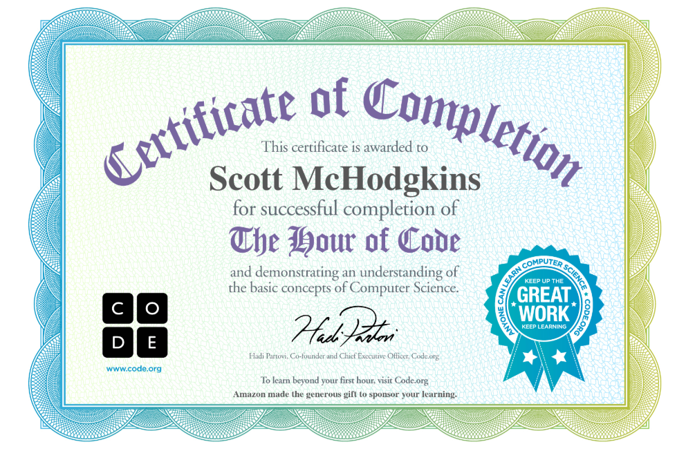

# Homework 2
---
## Questions
#### The Last Lecture Response
In the Last Lecture the concepts of not losing childlike wonder and not giving up stuck out the most to me. These two stuck out because I feel like the education system K-University is largely built to tell people what they can’t do, to fit them into standardized boxes. These pressures come from the rigid conformity applied to students the moment they arrive on the school premises and are enforced not just by the adults but also by peers. Dreams are great if they are “realistic” and socially acceptable. Permissible answers are those dictated by the textbook. Asking “why?” is frowned upon if it isn’t pertinent to the upcoming test. Standing out from peers is inadvisable due to herd mentality and social conditioning. Only attempt problems that already have written solutions. Yet we still subject children to this conformity crucible while simultaneously telling them to follow their dreams. A large portion of this talk was on “not giving up” and I think persistence is the most important variable in creative success. You have to reject the path of least resistance, fight the environmental pressures applied to you, and accept the consequences of being different. If we as a society want more creative children we should build environments conducive to this goal and find role models like Randy who will shepherd them towards their dreams.
#### Mindset Response
My result indicated I have an open mindset, which seems consistent with my life experience thus far. I’ve always thought that I could learn anything given enough time and effort and have been incredibly frustrated with people who react to failure with a refusal of additional effort because their ability is a foregone conclusion at the task. Hearing “wow, you must be gifted” would make my skin crawl because I knew the effort that I was putting into learning and it felt like a dismissal of that. Watching adults attempt something and immediately give up because they didn’t want to be perceived as incompetent was hard for me to understand. I do my best to learn and grow and want to help other people shift into growth mindsets as well because I believe the world would be better if more people thought that way.

---

---
